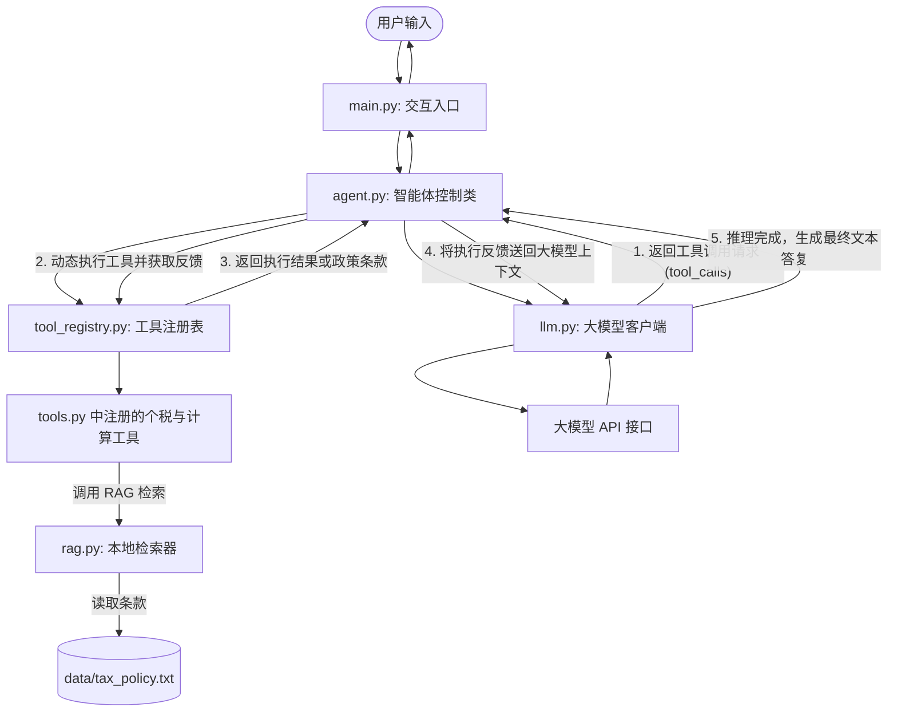

# 🤖 实验四：从零搭建大模型智能体（Agent）框架 (学生练习版)

这是一个**模块化、面向对象**的轻量级大模型智能体（Agent）框架。本项目为该实验的**学生练习版本**。你需要在给定的骨架代码中补充核心的**智能体 ReAct 推理与控制循环**，从而理解一个 Agent 是如何将大模型、记忆、工具链与规划流程有机融合在一起的。

本项目内置了一个结合 **RAG（检索增强生成）** 与 **多工具调用（Function Calling）** 的真实业务场景：**智能个人所得税与理财顾问**。

---

## 📂 1. 项目工程结构

工程根目录 `agent_lab_student/` 下包含以下核心模块：

- `config.json`：API 配置文件。你需要在此处配置你的 API 密钥。
- `config.py`：配置加载模块，提供多 API 的动态切换、加载与校验。
- `llm.py`：大模型客户端封装，基于 OpenAI 官方 SDK 驱动底座模型。
- `tool_registry.py`：工具注册与反射调用管理模块（此部分已在骨架中完整提供，无需修改）。
- `tools.py`：工程内置的全部业务工具函数文件（包含计算器、财务查询、个税政策检索等）。
- `agent.py`：智能体控制类。**【需要你补充 `run` 方法中的 ReAct 推理与工具调用双向循环逻辑】**。
- `rag.py`：轻量级本地中文 RAG 检索模块，实现本地个税政策文本检索。
- `main.py`：终端 CLI 交互程序入口，引入 `tools` 进行工具注册并启动交互。
- `test_agent.py`：系统集成测试文件。你可以运行此文件来检验你的代码实现是否 100% 正确。

---

## 🏗️ 2. 实验任务说明

整个 Agent 系统的架构设计与工作流程如下：



为了完成这个智能体系统，你需要填补以下核心的 **TODO** 任务：

### 🎯 实验任务：补充 `agent.py` 中的 ReAct 推理与工具执行循环
打开 [agent.py](file:///d:/Repository/HBPU-AI/agent_lab_student/agent.py) 文件，补充 **`run(self, user_message: str)`** 方法：
*   **短期记忆构建**：将用户的输入消息记录入 `self.memory`。
*   **获取可选工具**：从全局工具注册表 `tool_registry` 中动态获取当前的 OpenAI Tool Schemas 列表。
*   **驱动大模型决策**：调用大模型，传入当前的记忆链与工具集。
*   **处理工具调用反馈**：如果大模型要求调用工具（包含 `tool_calls`），则需要遍历所有调用，利用反射执行，并将角色为 `"tool"` 的执行反馈实时 append 追加回 `self.memory` 中，实现决策循环。
*   **输出最终回答**：当大模型评估后无需调用任何工具时，返回最终答复，终止循环。

---

## 🚀 3. 如何运行与验证

### 1. 配置 API 密钥
打开 `agent_lab_student/config.json`，在对应的提供商（例如 `siliconflow` 或 `openai`）中配置你的 API 密钥，并在 `active_provider` 字段中指定你当前想要启用的提供商。

### 2. 运行单元测试验证你的代码实现
在 `agent_lab_student` 目录下执行单元测试：
```bash
python test_agent.py
```
*   如果提示 `OK`，代表你的 Agent ReAct 推理控制循环连通性实现正确！

### 3. 启动交互式终端体验 Agent
当你通过了单元测试，直接运行主交互程序：
```bash
python main.py
```
你可以尝试向 Agent 提问以下复杂个税/财务问题，观察它是如何自动规划、调用工具和 RAG 并给出完美答复的：
*   *“你好，我是用户 S2026。请问根据国家规定，我的继续教育支出可以扣除多少个税？另外，帮我算算我今年应纳税所得额扣除免税额、专项扣除（假设只扣除继续教育和子女教育，且子女教育按100%全额扣除）以及起征点后的应缴纳的个税。”*
*   *“计算 125 * 8 等于多少？”*
